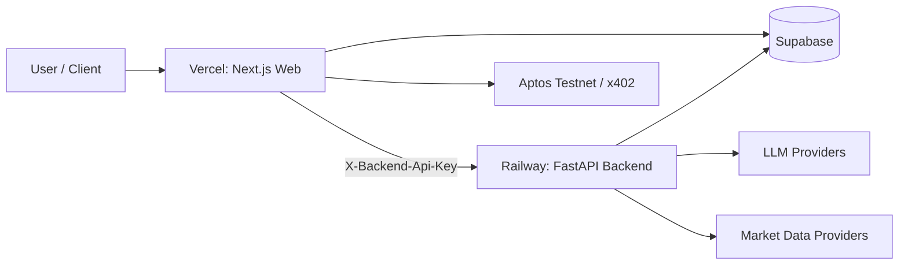

# Stock-Radar
Link: https://stock-radar-9t24-g1nmffqdl-darshans-projects-84a52e39.vercel.app/

Pay-per-use financial intelligence APIs with blockchain-native payments, async AI analysis jobs, and an operator-ready dashboard.

## Why Stock-Radar
Stock-Radar is built for developers who want production-style market intelligence without subscription lock-in:

- Query only what you need, pay only for what you call.
- Expose discoverable machine-to-machine endpoints (`/api/agent/discover`, `/api/agent/message`).
- Support payment-gated routes through x402 + Aptos.
- Keep analysis state in Supabase and run compute in a dedicated Python backend.

## What You Get
- Next.js app (`web`) with dashboard + public API routes.
- FastAPI backend (`backend`) for heavy analysis workloads.
- Async job flow for long-running analysis (`/api/analyze` + `/api/analyze/status`).
- Agent endpoints for momentum, scoring, sentiment, fundamentals, and orchestration.
- On-chain agent identity/reputation integration on Aptos testnet.

## Architecture


## Repository Map
- `web/`: Next.js 16 app, UI, public API routes, x402 enforcement/proxy
- `backend/`: FastAPI service used by `web` for analysis/agent compute
- `src/`: Python analysis engine, agents, storage, orchestration logic
- `move-agent-registry/`: Move contracts for agent registry/reputation
- `demo-client/`: CLI demo for payment flow
- `docs/deploy-vercel-railway.md`: Production deployment runbook

## Quick Start (Local)
### 1. Prerequisites
- Node.js 20+
- Python 3.11+
- npm
- Supabase project (URL + keys)

### 2. Configure Environment
From repo root:
```bash
cp .env.example .env
```

From `web/`:
```bash
cp .env.example .env.local
```

Minimum required values:

Backend (`.env`):
- `BACKEND_API_KEY`
- `SUPABASE_URL`
- `SUPABASE_KEY`
- one of `ZAI_API_KEY` or `GROQ_API_KEY` or `GEMINI_API_KEY`

Web (`web/.env.local`):
- `NEXT_PUBLIC_SUPABASE_URL`
- `NEXT_PUBLIC_SUPABASE_ANON_KEY`
- `PY_BACKEND_URL=http://localhost:8000`
- `PY_BACKEND_API_KEY=<same as BACKEND_API_KEY>`

### 3. Install Dependencies
```bash
# Python deps
pip install -r requirements.txt

# Web deps
cd web
npm install
```

### 4. Run Backend
From repo root:
```bash
uvicorn backend.app:app --host 0.0.0.0 --port 8000 --reload
```

Health check:
```bash
curl http://localhost:8000/health
```

### 5. Run Web App
In a second terminal:
```bash
cd web
npm run dev
```

Open:
- `http://localhost:3000`
- `http://localhost:3000/x402-demo`

## API Quickstart
### Service Health
```bash
curl -s http://localhost:3000/api/health | jq .
```

### Agent Discovery
```bash
curl -s http://localhost:3000/api/agent/discover | jq .
```

### Submit Async Analysis
```bash
curl -s -X POST http://localhost:3000/api/analyze \
  -H "Content-Type: application/json" \
  -d '{"symbol":"AAPL","mode":"intraday"}' | jq .
```

### Poll Analysis Status
```bash
curl -s "http://localhost:3000/api/analyze/status?jobId=<JOB_ID>" | jq .
```

### Ask Endpoint
```bash
curl -s -X POST http://localhost:3000/api/ask \
  -H "Content-Type: application/json" \
  -d '{"question":"Summarize AAPL momentum","symbol":"AAPL"}' | jq .
```

## x402-Paid Endpoint Examples
Without payment header, paid routes return HTTP `402`:
```bash
curl -i "http://localhost:3000/api/agent/momentum?symbol=AAPL"
```

For internal/testing bypass flows, configure `INTERNAL_API_KEY` and pass:
```bash
-H "X-Internal-Key: <INTERNAL_API_KEY>"
```

## Deploy (Recommended: Vercel + Railway)
Use split deployment:
- `web` on Vercel
- `backend` on Railway (Dockerfile: `Dockerfile.backend`)
